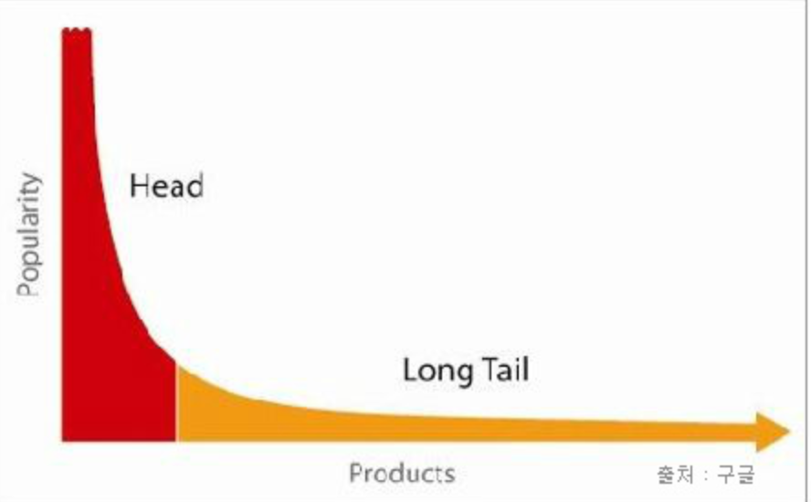

# Spring Cache

## 1. 캐시

### Long Tail 법칙
  
* 20%의 요구가 시스템 리소스의 대부분을 잡아먹는다는 법칙. 
* 자주 사용되는 **20%의 기능에 캐시를 이용하면** 리소스 사용량을 대폭 줄일 수 있어, **시스템의 성능을 대폭 향상** 시킬 수 있다.

### 캐시를 사용하는 이유?
* 사용되었던 데이터는 다시 사용되어 질 가능성이 높다.
* 다시 사용될 확률이 높은 데이터들은 접근 속도가 빠른 저장소에 저장.
* 보통 접근 속도가 빠른 데이터는 휘발성이 강하기 때문에 꼭 영속성이 강한 저장소와 같이 사용해야 한다.

### 캐시 용어
* 캐시 히트(Cache Hit)
  * 참조하고자 하는 메모리가 캐시에 있을 경우
* 캐시 미스(Cache Miss)
  * 참조하고자 하는 메모리가 캐시에 없는 경우
  * 캐싱 작업을 진행한다.

### 캐시하면 좋은 정보들
*  단순한, 또는 단순한 구조의 정보 (정보의 단순성) 
*  반복적으로 동일하게 제공 해야함 (빈번한 동일 요청의 반복)
*  정보의 변경 주기가 빈번 하지 않고, 단위 처리 시간이 오래 걸리는 정보 (높은 단위 처리 비용)
*  정보의 최신화가 반드시 실시간으로 이뤄지지 않아도 서비스 품질에 영향을 거의 주지 않는 정보 

### 캐시를 사용할 때 주의할 점
* 캐싱할 정보의 선택
* 캐싱할 정보의 유효 기간 (TTL - Time To Live ) 설정
* 캐싱한 정보의 갱신 시점

## 2. Spring Cache
* Spring은 캐시 추상화를 통해서 쉽게 캐시를 사용할 수 있습니다.
* 실제 캐싱 로직을 담당하는 CacheManager 구현체
  * EhCacheManager, RedisCacheManager, SimpleCacheManager 등등
  * 미리 구현된 캐시 저장소와 CacheManager를 사용하면 된다.
* 캐시 사용을 담당하는 어노테이션
  * @Cacheable, @CachePut, @CacheEvict

### 캐시 저장소
* Default
  * [ConcurrentHashMap](https://docs.oracle.com/javase/7/docs/api/java/util/concurrent/ConcurrentHashMap.html) 기반의 [Simple 구현체](https://docs.spring.io/spring-boot/docs/current/reference/html/spring-boot-features.html#boot-features-caching-provider-simple)를 제공
* [EhCache](https://www.ehcache.org/)
  * 속도가 빠른 경량 캐시
  * Local 캐시
* [Redis](https://redis.io/))
  * 분산 메모리 저장소
  * Key, Value 저장소
  * 성능적으로 검증이된 저장소
* [Hazelcast](https://hazelcast.com/)
  * 분산 메모리 저장소
  * 객체 저장
  * Lock, Transaction, Sharding 지원

### Annotation
#### @EnableCaching - 캐시 설정
* Spring에서 기본 캐시 설정이 off 되어 있어서 캐시 설정을 별도로 추가 해야합니다.
```java
@EnableCaching
@Configuration
public class CacheConfig {
}
```

* 보통 위와 같이 `@EnableCaching` 어노테이션만 붙여줘도 되지만 직접 구현한 CacheManager를 사용하고 싶으면 이 곳에서 Bean으로 등록하면됩니다.  
```java
@Configuration
@EnableCaching
public class CachingConfig {
 
    @Bean
    public CacheManager cacheManager() {
        return new CustomCacheManager("test");
    }
}
```
#### @Cacheable, @CachePut - 캐시 등록
* 기본 사용법
```java
@Cacheable("books")
public Book findBook(ISBN isbn, boolean checkWarehouse, boolean includeUsed)
```

* 여러 캐시 저장소에 저장
```java
// books, isbns에 저장
@Cacheable({ "books", "isbns" })
public Book findBook(ISBN isbn) {...}
```

* 키와 같이 저장
```java
// key: ISBN / value: Book
@Cacheable(value="books", key="#isbn")
public Book findBook(ISBN isbn, boolean checkWarehouse, boolean includeUsed)

// key: ISBN.rawNumber / value: Book
@Cacheable(value="books", key="#isbn.rawNumber")
public Book findBook(ISBN isbn, boolean checkWarehouse, boolean includeUsed)

// key: ISBN type / value: Book
@Cacheable(value="books", key="T(someType).hash(#isbn)")
public Book findBook(ISBN isbn, boolean checkWarehouse, boolean includeUsed)
```

* 조건부 저장
```java
// 이름이 32글자보다 작을떄 캐시
@Cacheable(value="book", condition="#name.length < 32")
public Book findBook(String name)
```

* 주의점
  * `@Cacheable`과 `@CachePut`는 같이 사용하지 말 것!
#### @CacheEvict - 캐시 삭제
```java
// books에 저장된 모든 캐시를 삭제
@CacheEvict(cacheNames="books", allEntries=true)
public void loadBooks(InputStream batch)
```

#### @CacheConfig
* class-level 어노테이션
* 하위 메소드의 어노테이션들이 `@CacheConfig`의 설정을 상속 받는다.
```java
@CacheConfig("books")
public class BookRepositoryImpl implements BookRepository {

    @Cacheable
    public Book findBook(ISBN isbn) {...}
}
```
#### 주의점!
* Spring Cache는 AOP 기반이기 때문에 public 메소드에만 사용이 가능하다!
* private 메소드는 객체 외부에서 접근할 수 없기 떄문에, interceptor가 불가능.
* java bytecode를 intercept하는(weaving 이라고 부름) 방법이 있긴 하지만... 권장 하진 않음.
```java
// 캐시 안됨!!!
@Cacheable("books")
private Book findBook(ISBN isbn, boolean checkWarehouse, boolean includeUsed)
```
### 참고
* https://docs.spring.io/spring/docs/4.3.15.RELEASE/spring-framework-reference/html/cache.html
* https://richong.tistory.com/95
* https://jaehun2841.github.io/2018/11/07/2018-10-03-spring-ehcache/#cache%EB%9E%80
* https://goodgid.github.io/Redis/
* https://yonguri.tistory.com/82
